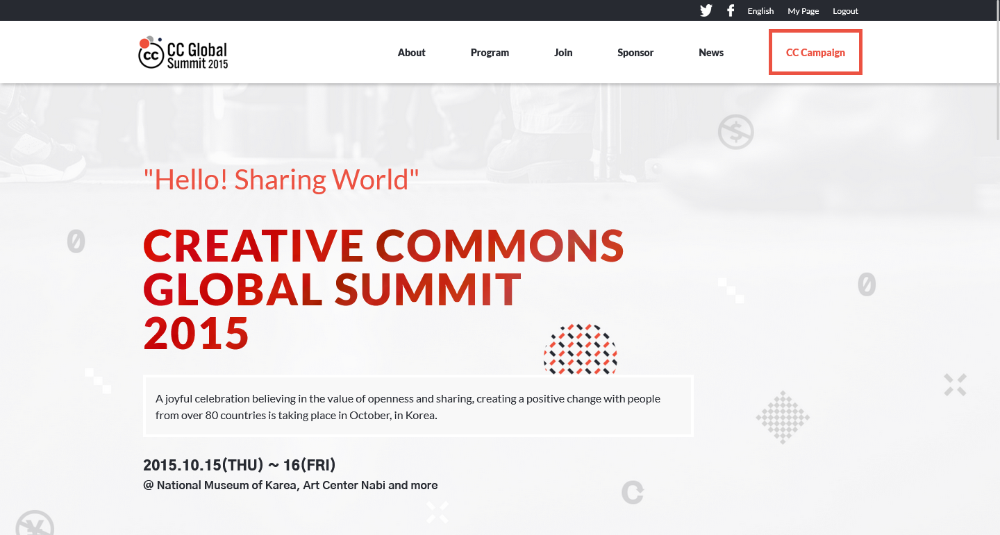
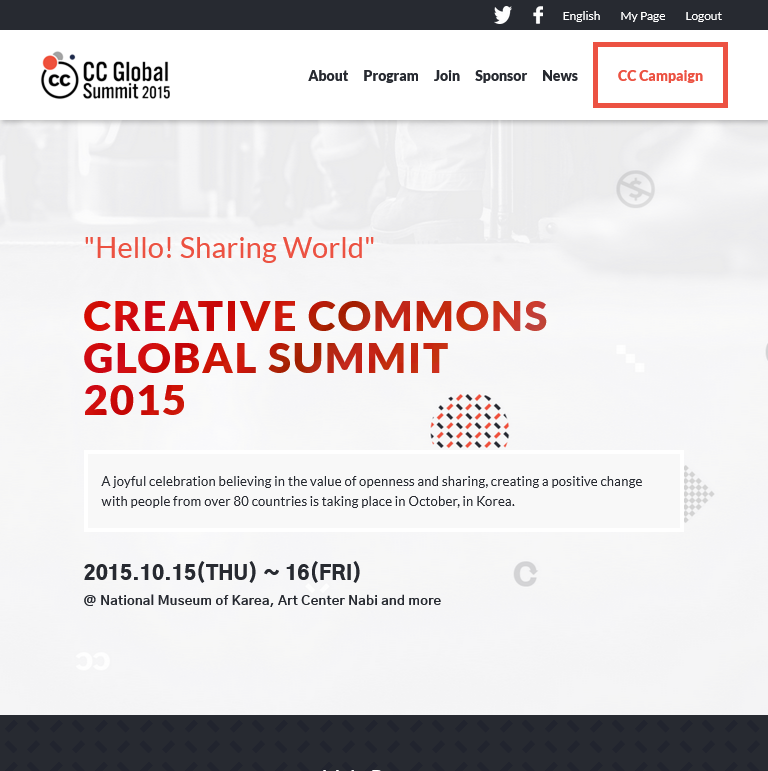
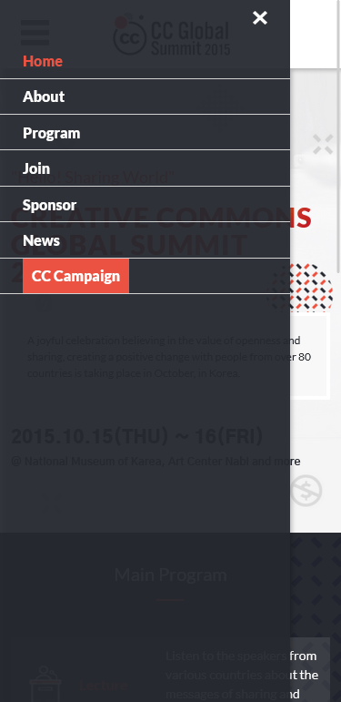

# HTML/CSS & JavaScript capstone project - Conference page

## Overview

As part of Microverse programme requirements for the completion of the **HTML/CSS & JavaScript Module**, I replicate the design of an online website for a conference based on the design [guidelines](https://github.com/microverseinc/curriculum-html-css/blob/main/capstone/html_capstone.md) proveided via [Cindy Shin in behance](https://www.behance.net/gallery/29845175/CC-Global-Summit-2015). In other to get a close approximate measurement of components on the website, a prototype of the site was created using [Figma](https://www.figma.com/file/V0vg37EZhAbP9nUPOeCy6p/HTML%2FCSS-%26-JavaScript-capstone-project---Conference-page?node-id=68%3A4) and Photoshop. However, further personalization was adopted to make the deliverable unique.

## Project Tasks List (Working-in-progress)

- [x] Setting up the initial project structure
- [x] mobile version skeleton
- [x] Desktop version
- [x] Mobile menu - javascript
- [x] Dynamic creation of html elements with javascript

> [Live Demo Link](https://fmanimashaun.github.io/Conference-page/)

> [Video Demo on LOOM](https://www.loom.com/share/fbebfa9e8d6b4a4c974a067554b75435)

## Screenshots

<h3 align="center">Desktop View</h3>

  

<h3 align="center">Tablet View</h3>

  

<h3 align="center">Mobile View</h3>

  

## Built With

- [HTML](https://developer.mozilla.org/en-US/docs/Web/HTML)
- [CSS](https://developer.mozilla.org/en-US/docs/Web/CSS)
- [JavaScript](https://developer.mozilla.org/en-US/docs/Web/JavaScript)
- [Algorithm Layout](https://every-layout.dev/)
- [Figma](https://www.figma.com)
- [Photoshop](https://www.adobe.com/africa/products/photoshop.html)

## Authors

👤 **Engr. Animashaun Fisayo**

- [GitHub](https://github.com/fmanimashaun)
- [Twitter](https://twitter.com/fmanimashaun)
- [LinkedIn](https://www.linkedin.com/in/fmanimashaun/)
- [Website](https://fmanimashaun.com)

## 🤝 Contributing

Contributions, issues, and feature requests are welcome!

Feel free to check the [issues page](../../issues/).

## Show your support

Give a ⭐️ if you like this project!

## Credit

- Design Inspiration by [Cindy Shin](https://www.behance.net/gallery/29845175/CC-Global-Summit-2015)

## 📝 License

[![CC BY-NC-SA 4.0][cc-by-nc-sa-shield]][cc-by-nc-sa]

This work is licensed under a
[Creative Commons Attribution-NonCommercial-ShareAlike 4.0 International License](./LICENSE)

[![CC BY-NC-SA 4.0][cc-by-nc-sa-image]][cc-by-nc-sa]

[cc-by-nc-sa]: http://creativecommons.org/licenses/by-nc-sa/4.0/
[cc-by-nc-sa-image]: https://licensebuttons.net/l/by-nc-sa/4.0/88x31.png
[cc-by-nc-sa-shield]: https://img.shields.io/badge/License-CC%20BY--NC--SA%204.0-lightgrey.svg